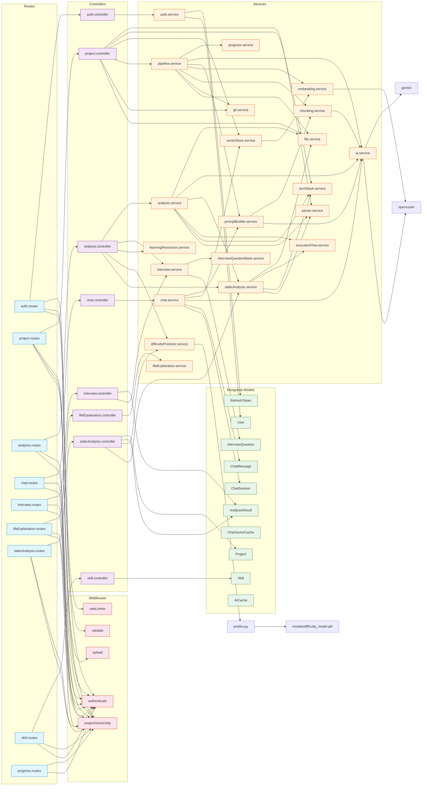

# Repo Analysis Report

> Comprehensive analysis of the LearnSmart repository — metrics, difficulty, and generated dependency graphs.
> Generated on: 2026-06-21

---

## 1. Analysis Pipeline

The dependency graph and difficulty score below are **outputs** of the static analysis engine (`server/src/services/staticAnalysis.service.js`). Every file in the repository is parsed, dependencies are resolved, and metrics are computed — all without AI.

```
┌─────────────────────────────────────────────────────────────┐
│                      INPUT: Repository                       │
│  All source files (*.js, *.jsx, *.ts, *.py, *.json, etc.)   │
└─────────────────────┬───────────────────────────────────────┘
                      │
                      ▼
┌─────────────────────────────────────────────────────────────┐
│               staticAnalysis.service.js                      │
│                                                              │
│  1. Read all text files             → rawFiles[]             │
│  2. parseAllFiles()                 → symbols, imports,      │
│       (regex-based parser)            exports per file       │
│  3. resolveDependencies()           → dependency graph       │
│  4. extractArchitectureSummary()    → layers, entry point    │
│  5. detectAll() (tech stack)        → languages, frameworks  │
│  6. extractAllRoutes()              → API endpoints          │
│  7. extractMongooseModels()         → DB schemas             │
│  8. computeMetrics()                → LOC, complexity, etc.  │
└──────────┬────────────────────────────────┬──────────────────┘
           │                                │
           ▼                                ▼
┌──────────────────────┐    ┌──────────────────────────────┐
│   OUTPUT: Metrics     │    │  OUTPUT: Dependency Graph    │
│   • totalFiles: 148   │    │  • nodes[]: every file       │
│   • totalLOC: ~45K    │    │  • edges[]: import links     │
│   • avgCyclomaticCC   │    │  • circular deps detected    │
│   • maintainability   │    │                              │
│   • comment %         │    │  OUTPUT: API Flow Diagram    │
│   • folder depth, etc.│    │  • routes → middleware →     │
└──────────┬────────────┘    │    controllers → services    │
           │                 └──────────────────────────────┘
           ▼
┌─────────────────────────────────────────────────────────────┐
│   difficultyPredictor.service.js                             │
│   (spawns Python → XGBoost ML model)                        │
│                                                              │
│   Input metrics:                                              │
│     LOC, fileCount, avgCC, maxCC, functionCount,             │
│     folderDepth, depChainLength, circularDepCount,           │
│     routeCount, asyncCount, classCount, errorHandlers,       │
│     maintainabilityIndex, commentPercent                     │
│                                                              │
│   Output:                                                     │
│     score (0-10), level, dimensions, learning time, etc.     │
└─────────────────────────────────────────────────────────────┘
```

---

## 2. Project Difficulty Analysis

The difficulty score is computed by the **XGBoost ML model** (`server/services/difficultyPredictor.service.js` → `predict.py` → `difficulty_model.pkl`). It takes **14 metrics** from the static analysis and produces a multi-dimensional difficulty assessment.

### 2.1 Input Metrics

```
totalLOC, fileCount, avgCyclomaticComplexity, maxCyclomaticComplexity,
functionCount, maxFolderDepth, dependencyChainLength, circularDependencyCount,
routeCount, asyncFunctionCount, classCount, errorHandlerCount,
maintainabilityIndex, commentPercent
```

### 2.2 Output Dimensions

| Dimension | Range | What It Measures |
|-----------|-------|-----------------|
| **Size** | 0–10 | Total LOC + file count → codebase scale |
| **Complexity** | 0–10 | Cyclomatic complexity → decision density |
| **Architecture** | 0–10 | Folder depth + dependency chain + circular deps → structural depth |
| **Surface** | 0–10 | Routes + async functions + classes → API surface area |
| **Quality** | 0–10 | Maintainability index + comment % + error handlers → code health |

### 2.3 Difficulty Levels

| Level | Score Range | Learning Time |
|-------|------------|---------------|
| **Beginner** | 0–2.5 | 5–15 hours |
| **Intermediate** | 2.5–5.0 | 20–40 hours |
| **Advanced** | 5.0–7.5 | 50–100 hours |
| **Expert** | 7.5–10 | 100+ hours |

### 2.4 Data Flow

```
staticAnalysis.metrics
    ↓
difficultyPredictor.service.js
    ↓ (spawns python predict.py)
XGBoost model (difficulty_model.pkl)
    ↓
JSON output: { score, level, color, confidence, probabilities,
               estimatedLearningTime, recommendedSkillLevel, dimensions }
    ↓
Saved as difficultyAnalysis in AnalysisResult (MongoDB)
    ↓
Returned to frontend as data.difficulty → rendered by DifficultyPanel.jsx
```

---

## 3. High-Level Architecture

```
┌──────────────────────────────────────┐
│            Client (React)            │
│  Vite + React 18 + Tailwind + React  │
│  Router v6 + React Flow + Mermaid    │
│                                      │
│  pages/ → components/ → api/ → axios │
│         → context/ → hooks/          │
└──────────────┬───────────────────────┘
               │ HTTP (REST API)
               ▼
┌──────────────────────────────────────┐
│         Server (Express 4)           │
│  Node.js + Express + Mongoose + JWT  │
│  + Passport.js + Multer + Zod       │
│                                      │
│  routes/ → controllers/ → services/  │
│  middleware/ → models/ → MongoDB     │
└──────────────────────────────────────┘
```

---

## 4. Analysis-Generated Dependency Graph

> The graph below is **generated by `staticAnalysis.service.js`** — every node and edge comes from parsing actual import/require statements across all source files.

### 4.1 Client Dependency Graph *(generated from static analysis)*

```mermaid
graph TD
    %% Entry Points
    index_html["index.html"] --> src_index["src/index.jsx"]
    src_index --> src_App["src/App.jsx"]
    src_index --> src_styles["src/styles/index.css"]

    %% App Router
    src_App --> AuthContext["context/AuthContext.jsx"]
    src_App --> Navbar["components/common/Navbar.jsx"]
    src_App --> ProtectedRoute["components/common/ProtectedRoute.jsx"]
    src_App --> HomePage["pages/HomePage.jsx"]
    src_App --> LoginPage["pages/LoginPage.jsx"]
    src_App --> RegisterPage["pages/RegisterPage.jsx"]
    src_App --> OAuthCallback["pages/OAuthCallbackPage.jsx"]
    src_App --> Dashboard["pages/DashboardPage.jsx"]
    src_App --> Upload["pages/UploadPage.jsx"]
    src_App --> Analysis["pages/AnalysisPage.jsx"]
    src_App --> Visualization["pages/VisualizationPage.jsx"]

    %% Context Dependencies
    AuthContext --> auth_api["api/auth.api.js"]
    AuthContext --> storage["utils/storage.js"]

    %% Auth Pages
    LoginPage --> AuthContext
    LoginPage --> LoginForm["components/auth/LoginForm.jsx"]
    LoginPage --> OAuthButtons["components/auth/OAuthButtons.jsx"]

    RegisterPage --> AuthContext
    RegisterPage --> RegisterForm["components/auth/RegisterForm.jsx"]
    RegisterPage --> OAuthButtons

    OAuthCallback --> AuthContext

    %% Dashboard Page
    Dashboard --> AuthContext
    Dashboard --> project_api["api/project.api.js"]
    Dashboard --> DiffSection["components/dashboard/DifficultyAnalysisSection.jsx"]

    %% Upload Page
    Upload --> project_api
    Upload --> GitHubPicker["components/dashboard/GitHubRepoPicker.jsx"]
    Upload --> RepoInput["components/dashboard/RepoLinkInput.jsx"]

    %% Analysis Page
    Analysis --> useAnalysis["hooks/useAnalysis.js"]
    Analysis --> ProjectOverview["components/analysis/ProjectOverview.jsx"]
    Analysis --> ArchGraph["components/analysis/ArchitectureGraph.jsx"]
    Analysis --> ExpCards["components/analysis/ExplanationCards.jsx"]
    Analysis --> IntPanel["components/analysis/InterviewQuestionsPanel.jsx"]
    Analysis --> NotesBtn["components/analysis/NotesButton.jsx"]
    Analysis --> KnowledgeGraph["components/analysis/KnowledgeGraph.jsx"]
    Analysis --> SecurityReport["components/analysis/SecurityReport.jsx"]
    Analysis --> ProgressLoader["components/common/ProgressLoader.jsx"]
    Analysis --> AIChat["components/analysis/AIChat.jsx"]
    Analysis --> LearnResources["components/analysis/LearningResources.jsx"]
    Analysis --> DiffPanel["components/analysis/DifficultyPanel.jsx"]

    %% Visualization Page
    Visualization --> static_api["api/staticAnalysis.api.js"]
    Visualization --> DiagControls["components/visualization/DiagramControls.jsx"]
    Visualization --> DepGraph["components/visualization/DependencyGraph.jsx"]
    Visualization --> APIFlow["components/visualization/APIFlowDiagram.jsx"]
    Visualization --> DBER["components/visualization/DatabaseERDiagram.jsx"]
    Visualization --> ExecFlow["components/visualization/ExecutionFlow.jsx"]

    %% API Layer
    auth_api --> api_client["api/client.js"]
    project_api --> api_client
    static_api --> api_client
    analysis_api["api/analysis.api.js"] --> api_client
    interview_api["api/interview.api.js"] --> api_client

    api_client --> storage

    %% Hooks
    useAnalysis --> analysis_api
    useAnalysis --> api_client

    %% Component-specific
    AIChat --> api_client
    AIChat --> storage
    NotesBtn --> analysis_api
    InterviewPanel --> interview_api
    ProgressLoader --> api_client
    GitHubPicker --> AuthContext
    LoginForm --> AuthContext
    RegisterForm --> AuthContext
    Navbar --> AuthContext
    ProtectedRoute --> AuthContext
    DiffSection --> static_api

    %% Styles
    subgraph Legend["Legend"]
        direction LR
        L1["📄 Page"]:::page
        L2["⚙️ Component"]:::component
        L3["🔌 API"]:::api
        L4["🔄 Context/Hook"]:::context
        L5["🛠️ Util"]:::util
    end

    classDef page fill:#e1f5fe,stroke:#0288d1
    classDef component fill:#f3e5f5,stroke:#7b1fa2
    classDef api fill:#fff3e0,stroke:#e65100
    classDef context fill:#e8f5e9,stroke:#2e7d32
    classDef util fill:#fce4ec,stroke:#c62828
```



---

## 5. Server Dependency Graph *(generated from static analysis)*

### 5.1 Entry Point & Configuration

```mermaid
graph TD
    app_js["src/app.js"] --> connectDB["config/db.js"]
    app_js --> env_config["config/env.js"]
    app_js --> errorHandler["middleware/errorHandler.js"]
    app_js --> rateLimiter["middleware/rateLimiter.js"]
    app_js --> auth_routes["routes/auth.routes.js"]
    app_js --> project_routes["routes/project.routes.js"]
    app_js --> analysis_routes["routes/analysis.routes.js"]
    app_js --> chat_routes["routes/chat.routes.js"]
    app_js --> interview_routes["routes/interview.routes.js"]
    app_js --> fileExp_routes["routes/fileExplanation.routes.js"]
    app_js --> progress_routes["routes/progress.routes.js"]
    app_js --> static_routes["routes/staticAnalysis.routes.js"]

    connectDB --> env_config
    env_config --> zod["zod"]
    gemini["config/gemini.js"] --> env_config
    openrouter["config/openrouter.js"] --> env_config
    passport["config/passport.js"] --> env_config
    passport --> UserModel["models/User.js"]

    %% Config connections
    app_js --> gemini
    app_js --> openrouter
    app_js --> passport

    classDef entry fill:#e1f5fe,stroke:#0288d1
    classDef config fill:#fff3e0,stroke:#e65100
    classDef model fill:#e8f5e9,stroke:#2e7d32

    class app_js entry
    class connectDB,env_config,gemini,openrouter,passport config
    class UserModel model
```



### 5.2 Routes → Controllers → Services



---

## 6. Full File Inventory

### 6.1 Client (`client/`)

| Layer | File | Depends On |
|---|---|---|
| **Entry** | `index.html` | `src/index.jsx` |
| **Entry** | `src/index.jsx` | `react`, `react-dom`, `./App`, `./styles/index.css` |
| **Root** | `src/App.jsx` | `AuthContext`, `Navbar`, `ProtectedRoute`, all pages |
| **Context** | `src/context/AuthContext.jsx` | `api/auth.api`, `utils/storage` |
| **API** | `src/api/client.js` | `axios`, `utils/storage` |
| **API** | `src/api/auth.api.js` | `./client` |
| **API** | `src/api/analysis.api.js` | `./client` |
| **API** | `src/api/interview.api.js` | `./client` |
| **API** | `src/api/project.api.js` | `./client` |
| **API** | `src/api/staticAnalysis.api.js` | `./client` |
| **Pages** | `LoginPage`, `RegisterPage` | `AuthContext`, auth components |
| **Pages** | `OAuthCallbackPage` | `AuthContext` |
| **Pages** | `DashboardPage` | `AuthContext`, `project.api`, `DiffSection` |
| **Pages** | `UploadPage` | `project.api`, `GitHubRepoPicker`, `RepoLinkInput` |
| **Pages** | `AnalysisPage` | `useAnalysis`, 10+ analysis components |
| **Pages** | `VisualizationPage` | `staticAnalysis.api`, 4 viz components |
| **Hooks** | `useAnalysis.js` | `analysis.api`, `api/client` |

### 6.2 Server (`server/`)

| Layer | File | Depends On |
|---|---|---|
| **Entry** | `src/app.js` | `config/*`, `routes/*`, `middleware/*` |
| **Config** | `config/db.js` | `mongoose`, `./env` |
| **Config** | `config/env.js` | `dotenv`, `zod` |
| **Config** | `config/gemini.js` | `@google/generative-ai`, `./env` |
| **Config** | `config/openrouter.js` | `openai`, `./env` |
| **Config** | `config/passport.js` | `passport`, OAuth strategies, `User` model |
| **Routes** (9) | `auth/project/analysis/chat/interview/fileExplanation/progress/skill/staticAnalysis` | controllers, middleware, validators |
| **Controllers** (8) | `auth/project/analysis/chat/interview/fileExplanation/skill/staticAnalysis` | services, models |
| **Services** (21) | See service graph above | other services, config, models, utils |
| **Middleware** (6) | `authenticate`, `errorHandler`, `projectOwnership`, `rateLimiter`, `upload`, `validate` | models, utils |
| **Models** (9) | `User`, `Project`, `AnalysisResult`, `RefreshToken`, `ChatSession`, `ChatMessage`, `ChatVectorCache`, `InterviewQuestion`, `Skill`, `AiCache` | `mongoose`, `bcryptjs` |
| **Validators** (2) | `auth.validator`, `analysis.validator` | `zod` |
| **Utils** (5) | `AppError`, `tokenUtils`, `constants`, `fileUtils`, `prompts` | `path`, `crypto`, `jsonwebtoken` |
| **Jobs** (1) | `cleanup.job.js` | `node-cron` |

---

## 7. Critical Dependency Chains

### Auth Flow
```
auth.routes → authenticate middleware → User model
           → auth validator → zod
           → auth.controller → auth.service
           → User + RefreshToken models
           → tokenUtils (JWT + crypto)
```

### Upload & Pipeline Flow
```
project.routes → authenticate + upload middleware → multer
              → project.controller → file.service (adm-zip)
              → git.service (clone via child_process)
              → pipeline.service → chunking.service
              → embedding.service → openrouter
              → promptBuilder.service → ai.service
              → progress.service (SSE)
```

### Analysis Flow
```
analysis.routes → authenticate + projectOwnership
               → analysis.controller → staticAnalysis.service
               → parser.service + techStack.service + executionFlow.service
               → difficultyPredictor.service → predict.py → XGBoost model
               → learningResources.service
               → interview.service → interviewQuestionBank.service
```

### Chat Flow
```
chat.routes → authenticate + projectOwnership
           → chat.controller → chat.service
           → vectorStore.service → embedding.service
           → promptBuilder.service → ai.service → openrouter
           → ChatSession + ChatMessage models
```

---

## 8. External Dependencies (npm)

### Client
```
react, react-dom, react-router-dom, axios, vite,
@vitejs/plugin-react, tailwindcss, postcss, autoprefixer
```

### Server
```
express, mongoose, bcryptjs, jsonwebtoken, dotenv,
cors, helmet, morgan, multer, zod, adm-zip,
passport, passport-google-oauth20, passport-github2,
@google/generative-ai, openai, express-rate-limit,
node-cron, yaml
```

---

## 9. Full File List

```
project2/
├── verify.js
├── ai-pipeline-architecture.md
├── auth-module-architecture.md
├── chat-system-architecture.md
├── learnsmart-architecture-plan.md
├── parser-engine-architecture.md
├── rag-pipeline-architecture.md
├── targeted-tech-detection-architecture.md
├── tech-detection-engine-architecture.md
├── upload-module-architecture.md
│
├── client/
│   ├── index.html
│   ├── package.json
│   ├── vite.config.js
│   ├── postcss.config.js
│   ├── tailwind.config.js
│   ├── .env.example
│   ├── .gitignore
│   ├── src/
│   │   ├── index.jsx
│   │   ├── App.jsx
│   │   ├── styles/index.css
│   │   ├── context/AuthContext.jsx
│   │   ├── api/
│   │   │   ├── client.js
│   │   │   ├── auth.api.js
│   │   │   ├── analysis.api.js
│   │   │   ├── interview.api.js
│   │   │   ├── project.api.js
│   │   │   └── staticAnalysis.api.js
│   │   ├── hooks/
│   │   │   ├── useAnalysis.js
│   │   │   ├── useDebounce.js
│   │   │   └── useUpload.js
│   │   ├── utils/
│   │   │   ├── storage.js
│   │   │   ├── constants.js
│   │   │   ├── formatters.js
│   │   │   └── markdown.js
│   │   ├── pages/
│   │   │   ├── HomePage.jsx
│   │   │   ├── LoginPage.jsx
│   │   │   ├── RegisterPage.jsx
│   │   │   ├── OAuthCallbackPage.jsx
│   │   │   ├── DashboardPage.jsx
│   │   │   ├── UploadPage.jsx
│   │   │   ├── AnalysisPage.jsx
│   │   │   ├── VisualizationPage.jsx
│   │   │   ├── InterviewPage.jsx
│   │   │   ├── ResumePage.jsx
│   │   │   └── NotFoundPage.jsx
│   │   └── components/
│   │       ├── auth/
│   │       │   ├── LoginForm.jsx
│   │       │   ├── RegisterForm.jsx
│   │       │   └── OAuthButtons.jsx
│   │       ├── common/
│   │       │   ├── Navbar.jsx
│   │       │   ├── ProtectedRoute.jsx
│   │       │   ├── ProgressLoader.jsx
│   │       │   ├── EmptyState.jsx
│   │       │   ├── ErrorAlert.jsx
│   │       │   ├── ErrorBoundary.jsx
│   │       │   ├── FileUploader.jsx
│   │       │   ├── Footer.jsx
│   │       │   ├── LoadingSkeleton.jsx
│   │       │   ├── LoadingSpinner.jsx
│   │       │   └── StatusBadge.jsx
│   │       ├── analysis/
│   │       │   ├── AIChat.jsx
│   │       │   ├── ArchitectureGraph.jsx
│   │       │   ├── DifficultyPanel.jsx
│   │       │   ├── ExplanationCards.jsx
│   │       │   ├── InterviewQuestionsPanel.jsx
│   │       │   ├── KnowledgeGraph.jsx
│   │       │   ├── LearningResources.jsx
│   │       │   ├── MetricsPanel.jsx
│   │       │   ├── NotesButton.jsx
│   │       │   ├── PerformanceInsights.jsx
│   │       │   ├── ProjectOverview.jsx
│   │       │   ├── SecurityReport.jsx
│   │       │   ├── ArchitectureBreakdown.jsx
│   │       │   ├── BeginnerGuide.jsx
│   │       │   ├── FileExplanationCard.jsx
│   │       │   ├── FileExplanations.jsx
│   │       │   ├── TechStackBadges.jsx
│   │       │   └── WorkflowExplanation.jsx
│   │       ├── dashboard/
│   │       │   ├── DifficultyAnalysisSection.jsx
│   │       │   ├── GitHubRepoPicker.jsx
│   │       │   ├── RepoLinkInput.jsx
│   │       │   ├── ProjectCard.jsx
│   │       │   ├── ProjectList.jsx
│   │       │   ├── QuickUpload.jsx
│   │       │   └── StatsOverview.jsx
│   │       ├── interview/
│   │       │   ├── CategoryFilter.jsx
│   │       │   ├── CustomQuestion.jsx
│   │       │   ├── QuestionCard.jsx
│   │       │   └── QuestionList.jsx
│   │       ├── resume/
│   │       │   ├── ProjectHighlights.jsx
│   │       │   ├── ResumeSummary.jsx
│   │       │   ├── SkillCard.jsx
│   │       │   └── SkillExtractor.jsx
│   │       └── visualization/
│   │           ├── APIFlowDiagram.jsx
│   │           ├── DatabaseERDiagram.jsx
│   │           ├── DependencyGraph.jsx
│   │           ├── DiagramControls.jsx
│   │           └── ExecutionFlow.jsx
│   └── dist/
│       ├── index.html
│       └── assets/
│
├── server/
│   ├── package.json
│   ├── Dockerfile
│   ├── docker-compose.yml
│   ├── .env.example
│   ├── .gitignore
│   ├── learnsmart-architecture.md
│   ├── src/
│   │   ├── app.js
│   │   ├── config/
│   │   │   ├── db.js
│   │   │   ├── env.js
│   │   │   ├── gemini.js
│   │   │   ├── openrouter.js
│   │   │   └── passport.js
│   │   ├── models/
│   │   │   ├── User.js
│   │   │   ├── Project.js
│   │   │   ├── AnalysisResult.js
│   │   │   ├── RefreshToken.js
│   │   │   ├── ChatSession.js
│   │   │   ├── ChatMessage.js
│   │   │   ├── ChatVectorCache.js
│   │   │   ├── InterviewQuestion.js
│   │   │   ├── Skill.js
│   │   │   └── AiCache.js
│   │   ├── middleware/
│   │   │   ├── authenticate.js
│   │   │   ├── errorHandler.js
│   │   │   ├── projectOwnership.js
│   │   │   ├── rateLimiter.js
│   │   │   ├── upload.js
│   │   │   └── validate.js
│   │   ├── routes/
│   │   │   ├── auth.routes.js
│   │   │   ├── project.routes.js
│   │   │   ├── analysis.routes.js
│   │   │   ├── chat.routes.js
│   │   │   ├── interview.routes.js
│   │   │   ├── fileExplanation.routes.js
│   │   │   ├── progress.routes.js
│   │   │   ├── skill.routes.js
│   │   │   └── staticAnalysis.routes.js
│   │   ├── controllers/
│   │   │   ├── auth.controller.js
│   │   │   ├── analysis.controller.js
│   │   │   ├── project.controller.js
│   │   │   ├── chat.controller.js
│   │   │   ├── interview.controller.js
│   │   │   ├── fileExplanation.controller.js
│   │   │   ├── skill.controller.js
│   │   │   └── staticAnalysis.controller.js
│   │   ├── services/
│   │   │   ├── ai.service.js
│   │   │   ├── analysis.service.js
│   │   │   ├── auth.service.js
│   │   │   ├── chat.service.js
│   │   │   ├── chunking.service.js
│   │   │   ├── difficultyPredictor.service.js
│   │   │   ├── embedding.service.js
│   │   │   ├── executionFlow.service.js
│   │   │   ├── file.service.js
│   │   │   ├── fileExplanation.service.js
│   │   │   ├── git.service.js
│   │   │   ├── interview.service.js
│   │   │   ├── interviewQuestionBank.service.js
│   │   │   ├── learningResources.service.js
│   │   │   ├── parser.service.js
│   │   │   ├── pipeline.service.js
│   │   │   ├── progress.service.js
│   │   │   ├── promptBuilder.service.js
│   │   │   ├── staticAnalysis.service.js
│   │   │   ├── techStack.service.js
│   │   │   ├── vectorStore.service.js
│   │   │   ├── predict.py
│   │   │   └── train_xgboost.py
│   │   ├── utils/
│   │   │   ├── AppError.js
│   │   │   ├── tokenUtils.js
│   │   │   ├── constants.js
│   │   │   ├── fileUtils.js
│   │   │   └── prompts.js
│   │   ├── validators/
│   │   │   ├── auth.validator.js
│   │   │   ├── analysis.validator.js
│   │   │   └── project.validator.js
│   │   └── jobs/
│   │       └── cleanup.job.js
│   ├── models/
│   │   ├── difficulty_model.pkl
│   │   └── difficulty_features.json
│   └── uploads/
│       └── ... (runtime directories)
```
